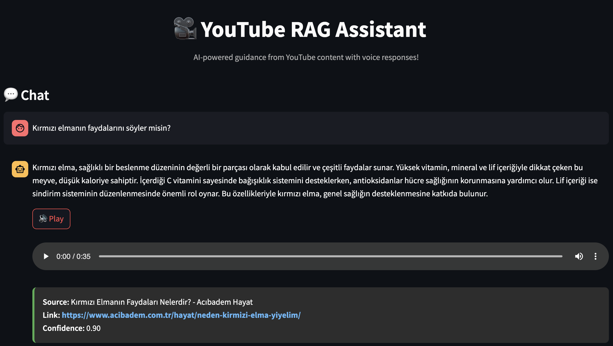

# YouTube RAG Assistant

A professional AI-powered chatbot that provides intelligent responses using YouTube video content as a knowledge base, with advanced Text-to-Speech capabilities. Built with modern RAG (Retrieval-Augmented Generation) architecture and deployed on Streamlit Cloud.

**Status:** Currently deployed and running on Streamlit Cloud

> Note: This is a private deployment. To run your instance, follow the setup instructions below.

## Key Features

### Advanced RAG System
- **Intelligent Content Retrieval**: Semantic search through YouTube video transcripts using BGE-M3 embeddings
- **Multi-source Intelligence**: Combines YouTube knowledge base with real-time web search fallback
- **Confidence-based Responses**: LLM evaluates response quality and automatically falls back to web search when needed
- **Source Attribution**: Every response includes video source, confidence score, and clickable YouTube links

### Text-to-Speech Integration
- **Professional Voice Synthesis**: ElevenLabs API integration with multilingual support
- **One-click Audio**: Generate speech for any response with a single button
- **Optimized Performance**: Efficient audio streaming and caching

### Multilingual Support
- **Turkish & English**: Automatic language detection and appropriate response generation
- **Language-aware Processing**: Matches query language with content language for optimal results

### Smart Features
- **Example Questions**: Quick access to common leadership and business queries
- **Conversation History**: Export chat sessions for future reference
- **Professional UI**: Clean, modern interface with dark theme
- **Real-time Processing**: Fast response generation with progress indicators

## Live Demo Examples




## Architecture

```
YouTube Playlist → Audio Download → Transcription → Vector Store → RAG → TTS → Web Interface
     ↓                   ↓             ↓              ↓             ↓     ↓         ↓
  pytubefix        OpenAI Whisper    BGE-M3         Qdrant    Gemini AI  Elevenlabs Streamlit
                                                      ↓
                                                  Web Search Fallback
                                                      ↓
                                                    DuckDuckGo API
```

### RAG Pipeline Flow
1. **Query Processing**: Language detection and intent analysis
2. **Vector Search**: Semantic similarity search in video transcripts
3. **Content Retrieval**: Extract best matching video content
4. **Response Generation**: Create contextual answer using Gemini AI
5. **Quality Evaluation**: LLM confidence scoring (0.0-1.0)
6. **Fallback Logic**: Web search if confidence < 0.5
7. **Source Attribution**: Add video links and confidence scores

## Project Structure

```
youtube-rag-assistant/
├── app.py                           # Main Streamlit application
├── requirements.txt                 # Python dependencies
├── .env.template                   # Environment variables template
├── Dockerfile                      # Container configuration
├── config/
│   ├── settings.yaml              # Application configuration
│   └── prompts.yaml              # LLM prompt templates
├── src/
│   ├── core/
│   │   ├── config.py             # Configuration management
│   │   └── models.py             # Data models and types
│   └── services/
│       ├── youtube_service.py    # YouTube video downloading
│       ├── transcription_service.py # Audio transcription
│       ├── vector_service.py     # Vector search and embeddings
│       ├── rag_service.py       # RAG implementation
│       ├── tts_service.py       # Text-to-Speech service
│       └── web_search_service.py # Web search fallback
├── data/                         # Data storage (gitignored)
│   ├── audio/                   # Downloaded audio files
│   ├── transcripts/             # Individual transcript files
│   ├── vector_db/               # Qdrant vector database
│   └── transcripts.json         # Video metadata
└── images/                      # Screenshots and assets
```

## Technology Stack

### Core Technologies
- **Python 3.11+**: Main programming language
- **Streamlit**: Interactive web application framework
- **Google Gemini AI**: Advanced language model for response generation
- **LangChain**: RAG framework and document processing
- **Qdrant**: High-performance vector database
- **HuggingFace Transformers**: BGE-M3 multilingual embeddings

### AI & ML
- **OpenAI Whisper**: Audio transcription with multilingual support
- **ElevenLabs API**: Professional text-to-speech synthesis
- **BGE-M3**: State-of-the-art multilingual embedding model
- **Sentence Transformers**: Text similarity and semantic search

### Data Processing
- **pytubefix**: YouTube video downloading and metadata extraction
- **PyYAML**: Configuration management
- **Pydantic**: Data validation and type safety

### Deployment
- **Streamlit Cloud**: Production deployment
- **Docker**: Containerization support
- **GitHub Actions**: CI/CD pipeline ready

## Quick Start

### 1. Clone Repository
```bash
git clone https://github.com/yourusername/youtube-rag-assistant.git
cd youtube-rag-assistant
```

### 2. Install Dependencies
```bash
pip install -r requirements.txt
```

### 3. Configure Environment
```bash
# Copy environment template
cp .env.template .env

# Add your API keys
export GEMINI_API_KEY="your_gemini_api_key_here"
export HF_TOKEN="your_huggingface_api_key_here"
export ELEVENLABS_API_KEY="your_elevenlabs_api_key_here"  # Optional for TTS
```

### 4. Run Application
```bash
streamlit run app.py
```

The application will be available at `http://localhost:8501`

## Configuration

### Environment Variables
```bash
# Required
GEMINI_API_KEY=your_gemini_api_key_here
HF_TOKEN=your_huggingface_api_key_here

# Optional (for TTS features)
ELEVENLABS_API_KEY=your_elevenlabs_api_key_here

# Optional (override default playlist)
YOUTUBE_PLAYLIST_URL=https://youtube.com/playlist?list=your_playlist_id
```

### Settings (config/settings.yaml)
```yaml
# AI Model Configuration
model_name: gemini-2.0-flash-exp
embedding_model: altaidevorg/bge-m3-distill-8l

# Vector Database
vector_db_path: data/vector_db
collection_name: youtube_transcripts
retrieval_k: 3
similarity_threshold: 0.7

# Processing Settings
whisper_model: medium
language: tr

# File Paths
data_dir: data
transcripts_json: data/transcripts.json
```

## Data Pipeline (Optional)

If you want to process your own YouTube content:

### 1. Download YouTube Audio
```bash
python src/services/youtube_service.py
```

### 2. Transcribe Audio
```bash
python src/services/transcription_service.py
```

### 3. Build Vector Database
```bash
python src/services/vector_service.py
```

### 4. Test Search
```python
from src.services.vector_service import VectorService

service = VectorService()
service.initialize_vector_store()

results = service.search("leadership strategies")
for result in results:
    print(f"{result.video_title}: {result.similarity_score:.3f}")
```

### 5. Test RAG Service
```python
from src.services.rag_service import RAGService

# Initialize RAG service
rag_service = RAGService()

# Test queries in both languages
test_queries = [
    "Nasıl etkili lider olunur?",
    "How to become a successful entrepreneur?", 
    "Takım motivasyonu stratejileri nelerdir?",
    "What are the best business strategies?"
]

# Test each query
for query in test_queries:
    print(f"\nQuery: {query}")
    response = rag_service.generate_response(query)
    
    print(f"Answer: {response.answer}")
    print(f"Confidence: {response.confidence_score:.3f}")
    print(f"Sources: {len(response.sources)}")
    
    # Show source details
    for source in response.sources:
        print(f"  - {source.video_title}: {source.similarity_score:.3f}")
        print(f"    URL: {source.video_url}")

## Advanced Features

### Confidence-Based Response System
The system evaluates each response using LLM confidence scoring:
- **High Confidence (≥0.5)**: Uses YouTube knowledge base response
- **Low Confidence (<0.5)**: Automatically falls back to web search
- **Transparent Scoring**: Shows confidence level for each response

### Multi-Source Intelligence
```python
# RAG Flow Example
1. Search YouTube transcripts → Generate response
2. LLM evaluates response quality → Confidence score
3. If low confidence → Web search fallback
4. Return best response with source attribution
```

### Professional TTS Integration
- **Voice Quality**: ElevenLabs multilingual voice synthesis
- **Performance**: Optimized audio streaming
- **Accessibility**: One-click speech generation
- **Fallback**: Graceful degradation when TTS unavailable

## Deployment

### Streamlit Cloud (Recommended)
1. Push code to GitHub repository
2. Connect to Streamlit Cloud
3. Set secrets in Streamlit dashboard:
   ```toml
   GEMINI_API_KEY = "your_api_key"
   HF_TOKEN="your_huggingface_api_key"
   ELEVENLABS_API_KEY = "your_elevenlabs_key"
   ```
4. Deploy automatically

### Docker Deployment
```bash
# Build image
docker build -t youtube-rag-assistant .

# Run container
docker run -p 8501:8501 \
  -e GEMINI_API_KEY="your_key" \
  -e HF_TOKEN="your_huggingface_api_key" \
  -e ELEVENLABS_API_KEY="your_elevenlabs_key" \
  youtube-rag-assistant
```

### Local Development
```bash
# Development mode with auto-reload
streamlit run app.py --server.runOnSave true
```

## Performance Metrics

### Response Quality
- **YouTube Knowledge**: High-quality responses from curated content
- **Web Fallback**: Real-time information when knowledge base is insufficient
- **Confidence Scoring**: Transparent quality metrics for each response

### Speed Benchmarks
- **Vector Search**: ~200ms for semantic similarity search
- **Response Generation**: ~1-3s with Gemini AI
- **TTS Generation**: ~2-5s for speech synthesis
- **Total Response Time**: ~3-8s end-to-end

### Accuracy Features
- **Source Attribution**: Every response linked to original video
- **Language Matching**: Queries matched with appropriate language content
- **Context Relevance**: Advanced embedding models for semantic understanding

## Security & Privacy

### API Key Management
- Environment variable-based configuration
- No hardcoded secrets in repository
- Streamlit secrets integration for cloud deployment

### Data Privacy
- Local vector database storage
- No user query logging
- Temporary audio processing only

## Error Handling

### Robust Fallback System
- **Vector Search Failure**: Graceful degradation to web search
- **API Timeouts**: Retry logic with exponential backoff
- **TTS Unavailable**: Silent fallback without breaking functionality
- **Configuration Errors**: Clear error messages and recovery suggestions

## Monitoring & Analytics

### System Health Checks
- Vector database connectivity
- API key validation
- Model availability status
- Response quality metrics

### Usage Analytics
- Response time monitoring
- Confidence score distribution
- Source attribution statistics
- TTS usage patterns

## Contributing

### Development Setup
```bash
# Clone repository
git clone https://github.com/ezgisubasi/youtube-rag-assistant.git

# Create virtual environment
python -m venv venv
source venv/bin/activate  # Linux/Mac
venv\Scripts\activate     # Windows

# Install development dependencies
pip install -r requirements.txt
```

### Code Standards
- **Type Hints**: All functions include type annotations
- **Documentation**: Comprehensive docstrings for all modules
- **Error Handling**: Graceful error handling with user-friendly messages
- **Testing**: Unit tests for all core functionality

## License

MIT License - see [LICENSE](LICENSE) file for details.

## Acknowledgments

- **OpenAI Whisper**: High-quality multilingual transcription
- **Google Gemini**: Advanced language model capabilities
- **ElevenLabs**: Professional text-to-speech synthesis
- **Streamlit**: Rapid web application development
- **LangChain**: Comprehensive RAG framework
- **Qdrant**: High-performance vector database

## Support

For issues, questions, or contributions:
- **Bug Reports**: [GitHub Issues](https://github.com/ezgisubasi/youtube-rag-assistant/issues)
- **Feature Requests**: [GitHub Discussions](https://github.com/ezgisubasi/youtube-rag-assistant/discussions)
- **Contact**: ezgisubasi1998@gmail.com

---

**Built with modern AI technologies and best practices.**
